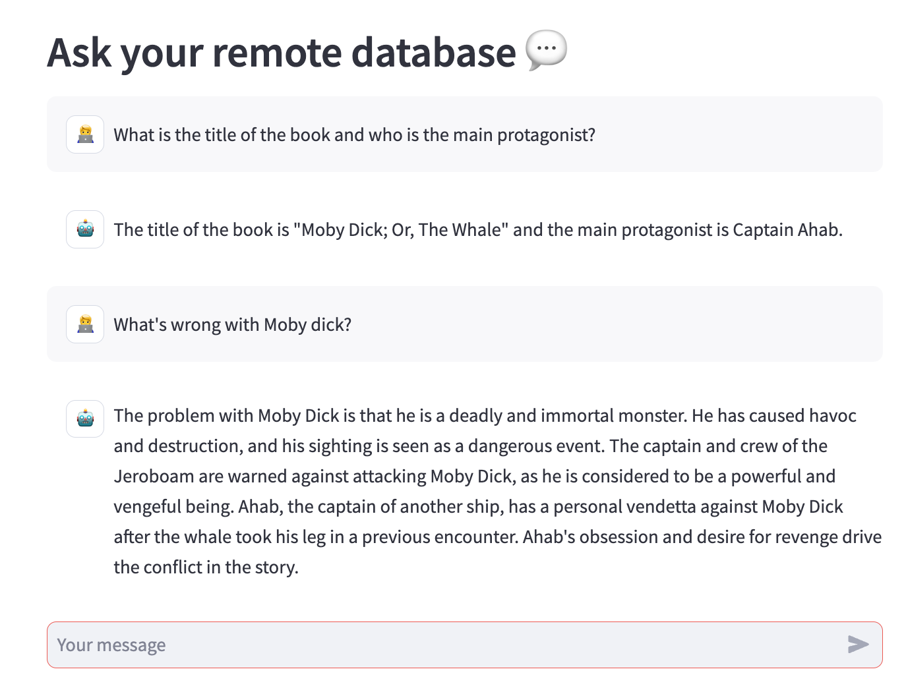

# bookNLP

> Project currently under development. My intention is to add useful content on a daily basis.

## Introduction

---

bookNLP is a Python application that allows you to chat with various digital books. You can ask questions about the epub using natural language, and the application will provide relevant answers (Retrievers) based on the previously processed content (Text Embeddings) hosted in the vector base [Qdrant](https://qdrant.tech).

## Example of working

---

